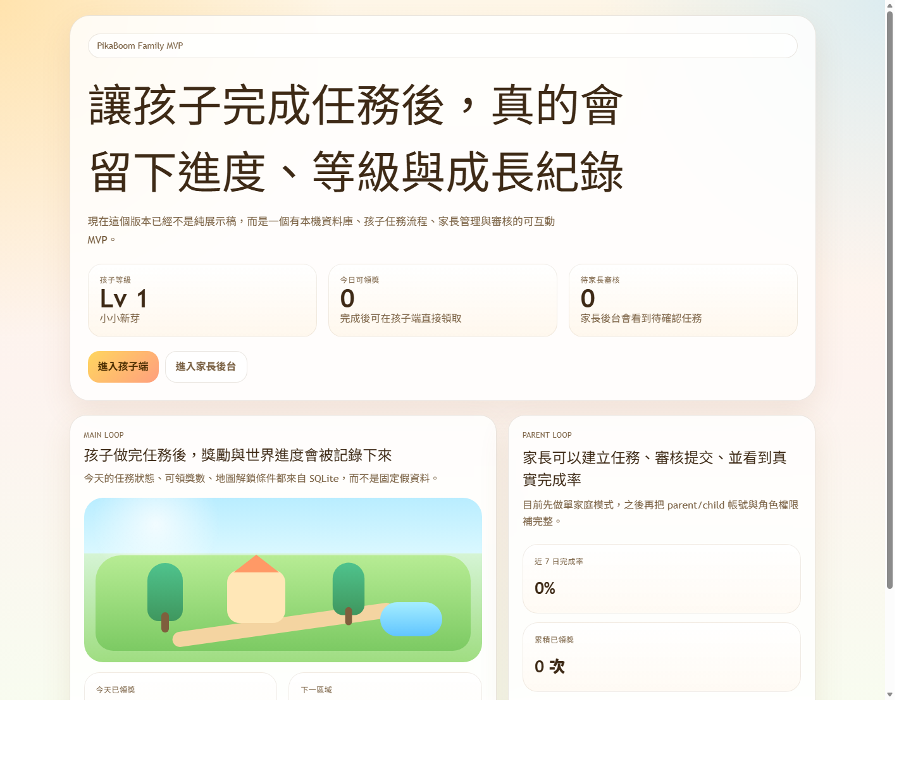
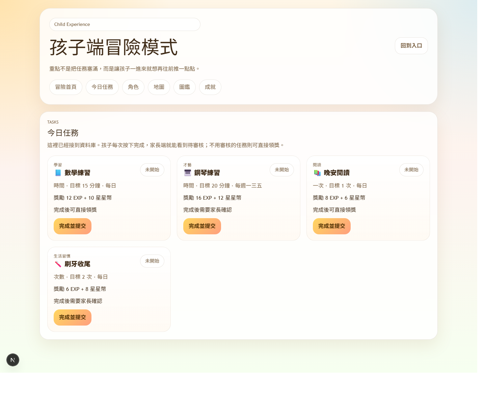
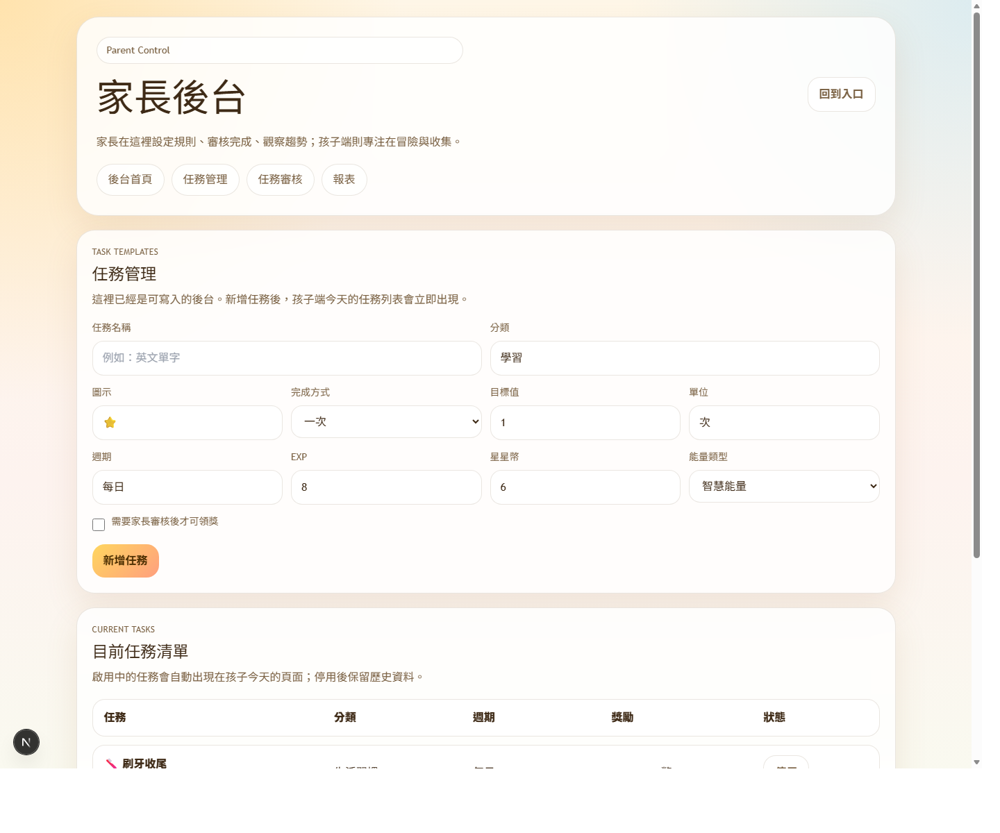

# PikaBoom

PikaBoom is a web game for families that turns real-world effort into visible progress, character growth, and world-building.

Instead of behaving like a plain checklist, it aims to help a child feel:

> I am getting stronger, unlocking things, and growing my adventure world.

## What It Does

- gives children a playful mission flow for daily tasks
- lets parents create, review, and manage those tasks
- records progress in a real local database
- converts completed tasks into EXP, streaks, stars, and unlock progress
- builds toward a parent-child gameplay loop instead of a plain habit tracker

## Current MVP

### Child Side

- adventure home
- today tasks
- character growth
- map progress
- collection page
- achievements page

### Parent Side

- dashboard
- task management
- task approval
- reports view

### Core System

- Next.js App Router frontend
- SQLite persistence with `better-sqlite3`
- server actions for submit / approve / reject / claim flows
- seeded single-family local data model

## Screenshots

### Home



### Child tasks



### Parent task management



## Tech Stack

- Next.js 16
- React 19
- Tailwind CSS
- TypeScript
- SQLite

## Local Development

```bash
npm install
npm run dev
```

Then open:

- `http://127.0.0.1:3000`
- `http://127.0.0.1:3000/child`
- `http://127.0.0.1:3000/parent`

## Build Check

```bash
npm run build
```

## Data Storage

- Local database: `data/pikaboom.db`
- Current mode: single-family local MVP

## Roadmap

1. Parent / child authentication and roles
2. Cloud database with Supabase or Postgres
3. Photo proof for tasks
4. Weekly challenges and achievement events
5. Richer reward animations and progression feedback

## Architecture Docs

- [Docs index](./docs/README.md)
- [Architecture decision](./docs/architecture-decision.md)
- [Application blueprint](./docs/application-blueprint.md)
- [Auth and access plan](./docs/auth-and-access-plan.md)
- [Supabase schema SQL](./docs/supabase-schema.sql)
